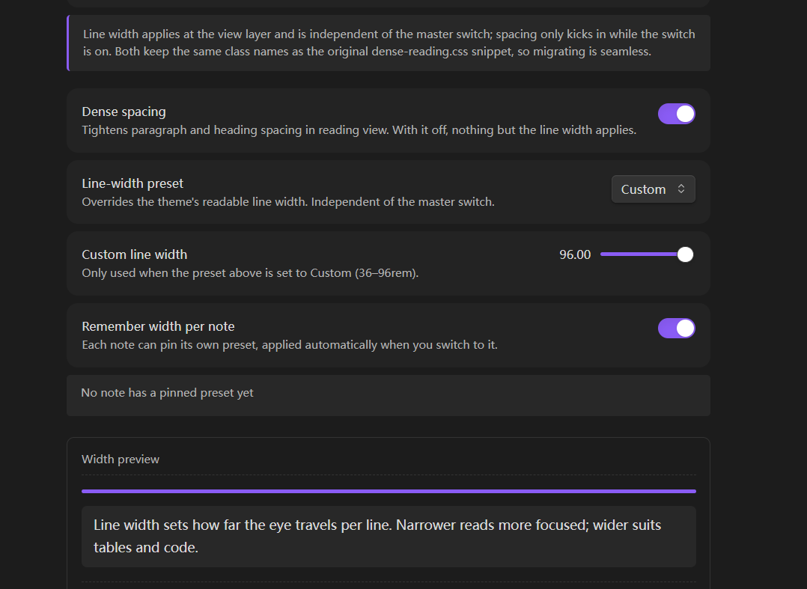

# Dense Reading

> Tighter paragraph and heading spacing for reading view, with a switchable
> line width — no Style Settings, no hand-written `cssclasses` frontmatter.

Dense Reading does two independent things, both purely at the display layer.
No file is modified, and nothing is written into your notes.

## Tight spacing

Long-form notes in Obsidian's reading view are spaced for skimming, not for
reading. Turning on the dense mode compresses paragraph margins, heading gaps
and list spacing to a reading rhythm, and drops the decorative chrome on `hr`
and inline code so they follow your text colour instead of shouting.

Spacing only ever applies when the switch is on. With it off, the plugin is
invisible.

## Line width

Reading width is the bigger lever. Dense Reading sets `--file-line-width` at
the **view layer**, which is what actually takes effect — the same value set on
`body` is overridden by Obsidian's inline `700px`.

| Preset | Width |
|---|---|
| 窄读 Narrow | 44rem |
| 均衡 Balanced | 54rem |
| 宽幅 Wide | 66rem |
| 超宽 Extra wide | 78rem |
| 自定义 Custom | 36–96rem, slider |

Width and spacing are independent: you can narrow the column without turning
on dense spacing, which is the common case for tables and code.

## Per-note width

A single global width is rarely right for every note. Readings sit well
narrower than a reference table. Dense Reading can remember a width per note:
pin one from the command palette, and it is applied whenever you open that
note. The list of pinned notes is shown in settings and can be cleared there.

## Commands

| Command | What it does |
|---|---|
| Toggle dense reading | Turns the spacing switch on or off |
| Cycle line width preset | Steps through the five presets |
| Pin line width for this note | Fixes the current preset to the active note |
| Clear line width for this note | Removes that note's pin |

No default hotkey is bound — width is a deliberate, occasional choice, and a
global key for it would fight whatever else you have on that key. Bind one in
Settings → Hotkeys if you want it.

## Installation

**Community plugins:** search for "Dense Reading" in Settings → Community
plugins.

**Manual:** download `main.js`, `manifest.json` and `styles.css` from the
[latest release](https://github.com/yunmin311/dense-reading-obsidian/releases)
into `<vault>/.obsidian/plugins/dense-reading/`, then enable it.

**Beta builds:** add `yunmin311/dense-reading-obsidian` to
[BRAT](https://github.com/TfTHacker/obsidian42-brat).

## Migrating from the CSS snippet

This plugin started life as a CSS snippet driven by Style Settings. The class
names are deliberately identical (`dense-w44` … `dense-w-custom`,
`dense-reading-mode`), so:

1. Install and enable the plugin; set your width and switch in its settings.
2. Delete `cssclasses: dense-w54` style frontmatter from your notes. The
   plugin no longer needs it — that was the point.
3. The snippet can stay enabled (the rules are the same, so they cannot
   conflict) or be disabled, since `styles.css` now carries them.

## Language

The settings page, commands and every notice are available in **Chinese and
English**. Pick a language at the top of the settings page: `Auto` follows
Obsidian's own language, or pin it to `简体中文` / `English` explicitly.

Adding another language is a pure data change — an extra entry in
`locales.js` — with no build step involved. Preset ids and CSS class names stay
language-independent, so switching language never changes what is applied.

## Privacy

No network access. No telemetry. No accounts. The plugin reads the path of the
active note to remember its width, and stores that map in its own `data.json`
inside the plugin folder — the same mechanism every Obsidian plugin uses.

## License

[MIT](LICENSE)

---

## 中文说明

**密排阅读**：把阅读视图的段落、标题、列表间距收紧密排，并让分隔线与行内代码
跟随正文颜色；这一组只在**总开关打开**时生效，关闭即完全无痕。

**行宽**则独立于总开关，写在**视图层**（写在 `body` 上会被 Obsidian 内联的
`--file-line-width: 700px` 压掉，这是踩过的坑）。五档可选，也可用滑条自定义
36–96rem。

**按笔记记住档位**：长文和参考表格需要的宽度往往不同。可以在命令面板把当前档位
固定到某篇笔记，之后每次打开自动套用；设置页里能看到并清除这些固定。

原来的 `dense-reading.css` 片段 + Style Settings 那套装法**已不需要**：
类名与片段完全一致，装好插件、把笔记 frontmatter 里的 `cssclasses: dense-w54`
删掉即可——这正是做成插件的意义。
